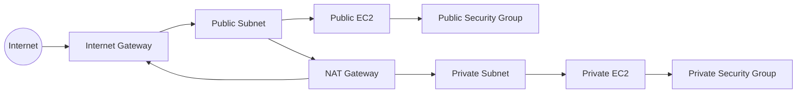
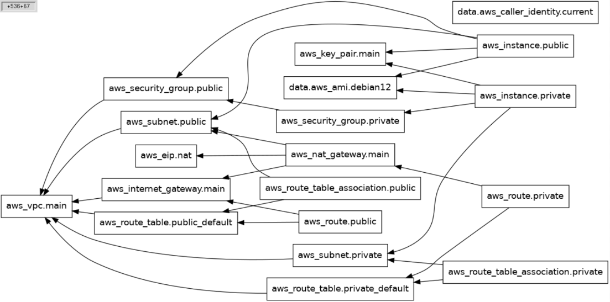

# Architecture


# Dependency graph

The below chart visualises which resources are dependent on the exististance of other resource(s) first before it can be created. Let's use the the NAT GW as an example. It has 3 arrows pointing to a public subnet, IG and EIP, all of which are required before the NAT can be created. 



# Structure
For the scope of this task, I have kept the file structure rather simplistic without making use of any modules. However, If this project was to be expanded, with more repetitive resoruces definitons, I would've created a modules directory for following: vpc, instance and security, with each including main.tf, variables.tf and outputs.tf
```
cian-tech-challenge-submission/ # root directory where you init, plan and apply terraform
	providers.tf 	            # Specifies tf version and both cloud provider + version
	variables.tf                # Reusable variables which can be called elsewhere
	vpc.tf                      # VPC, IG, NAT GW, subnets and route tables + routes
	security.tf                 # SG's for public + private VM's
	instances.tf                # AMI, keypair and both VM's 
	outputs.tf                  # Selected ouputs to be shown during terraform run
```
# Auth 
This project is intended to provision resources into our sandbox AWS account by making use of our existing IAM identity centre SSO permisson set `ConsoleCowboys` which has full administrative permissions to our Sandox AWS account.

AWS SSO profile will be used to authenticate. Please add the following to your local in `~/.aws/config`:
```
[profile <profile_name>]
sso_start_url = https://d-93675802b1.awsapps.com/start/#/?tab=accounts
sso_region = eu-west-1
sso_account_id = 214911257442
sso_role_name = ConsoleCowboys
region = eu-west-1
output = json
```
You can initiate your SSO session using the following command: `aws sso login --profile <profile_name>`
And export this profile so you don't need to specify the profile each time you use aws cli: `export AWS_PROFILE=<profile_name>`

# Setup 
Once auth is configured, you're ready to clone the repo, populate tfvars and start provisioning terraform resoruces 
- Clone the repo locally: `git clone git@github.com:ccorcoran23/cian-tech-challenge-submission.git` # Repo is on my GH profile
	# Connectivity to the VM
	This requires both your personal public IP and a newly generated keypair by following the below steps:
	- Get your public IP using `curl ifconfig.me`
	- Generate a keypair using: `ssh-keygen -t ed25519 -C "<key_name>"`
	- When prompted, save the priv key to `/local/.ssh/path/<key_name>` # Note your public key will be saved in this same directory labelled `<key_name>.pub`
	- Copy tfvars example template file using `cp terraform.tfvars.example terraform.tfvars`
	- Modify `terraform.tfvars` with the following:
	     - `allowed_ip_cidr` value with your public IP cidr
	     - `ssh_public_key_path` value with the local path to your new public key
 
- Initialize terraform: `terraform init`
- Check resource provisioning is successful: `terraform plan`
- Provision resoruces: `terraform apply`
